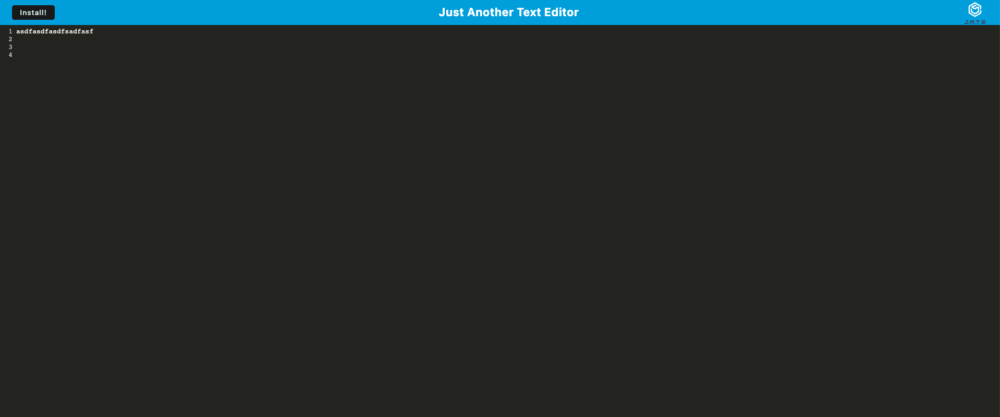

# Just Another Text Editor

## Description

This is a text editor that runs in the browser. The app is a single-page application that meets the PWA criteria. The application also functions offline.

Starting with an existing application, methods were implemented for getting and storing data to an IndexedDB database. 

## Functions

- Reopening after closing the content from the previous session displays
- Able to download the application as an icon on my computer
- Able to run the application offline 

## Tech Used

- idb package
- JavaScript
- HTML
- CSS
- Workbox
- Heroku
- Webpack

## Screenshot

## Credit

Starter code by Sachin Jhaveri via edx Module 19 Challenge.

## Usage

File can used and shared for knowledge or expansion, as needed.

## License

LICENSE.txt

## Links

- GitHub Repository: https://github.com/cherah-petra/Challenge19
- Heroku deployment: https://jatetexteditor23-ab2d0d4dd816.herokuapp.com/

